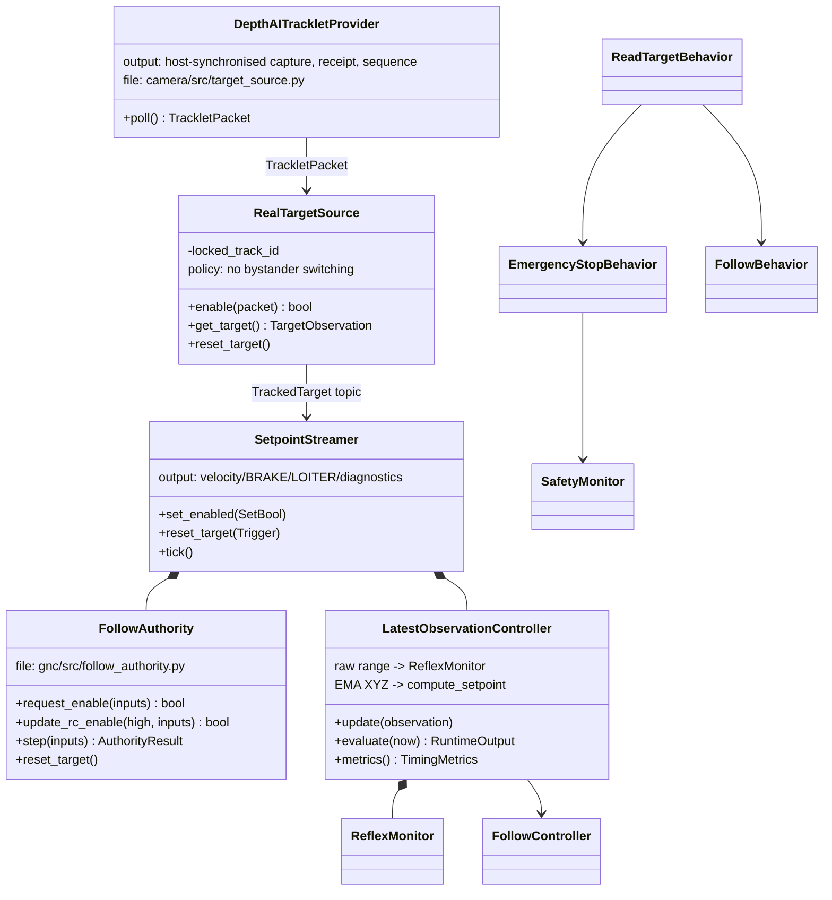
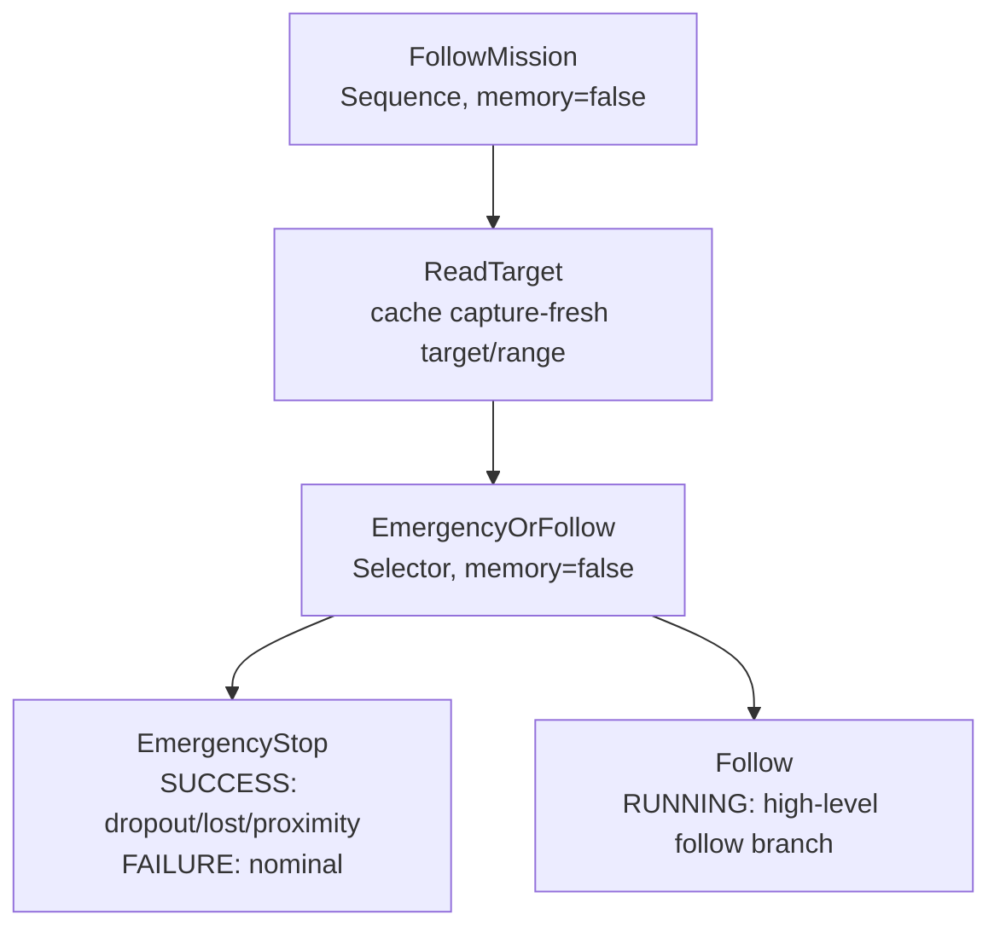
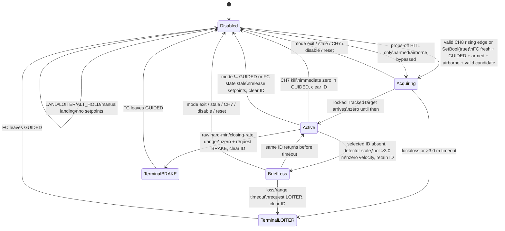

# Target-follow stack onboarding and operations

## Purpose and boundaries

The stack follows one explicitly selected person at a 2.5 m standoff. The
camera provides +X right, +Y down, +Z forward in metres. The controller sends
body velocity/yaw setpoints only while its authority state is active and the FC
remains in GUIDED.

Production follow does **not** request GUIDED, arm, or takeoff. A pilot owns all
three actions. Leaving GUIDED (including LAND, LOITER, or ALT_HOLD), stale FC
state, CH7 kill, disable/reset, target-loss timeout, or a proximity emergency
latches follow disabled and clears target ownership. Returning to GUIDED never
resumes follow; a new enable edge is required.

There is no obstacle avoidance, no automatic recovery after an emergency, and
no guarantee that BRAKE prevents a person from walking into a stationary
aircraft.

## Component and data flow

```mermaid
flowchart LR
    OAK["OAK-D RGB + stereo\ninput: images/depth\ncamera/src/target_source.py"]
    NN["MobileNet spatial detector\n20 or 10 Hz confirmed XYZ\ncamera/src/oakd_follow_pipeline.py"]
    OT["DepthAI ObjectTracker\n20 Hz ID/status; propagated frames\nwrapper/oakd_target_node.py"]
    CAND["/perception/target_candidate\nTrackedTarget, capture stamped\nsource rate; enable precondition only"]
    LOCK["Sticky RealTargetSource\nnearest only at explicit acquire\nthen same track ID only"]
    TARGET["/perception/target\nTrackedTarget; camera metres\ntrack ID + sequence + timing"]
    AUTH["FollowAuthority\nCH7 kill, CH8 edge, services\ngnc/src/follow_authority.py"]
    CTRL["LatestObservationController\nraw range safety + EMA XYZ control\ngnc/src/follow_runtime.py"]
    BT["2 Hz behavior tree\nhigh-level arbitration\nengine/follow_manager.py"]
    STREAM["20–50 Hz streamer\nauthority + latest control\nengine/setpoint_streamer.py"]
    MAVROS["/mavros/setpoint_raw/local\nPositionTarget body velocity\nstream rate while active"]
    FC["ArduPilot FC\ninputs: pilot mode/arm/takeoff\noutputs: state/RC/pose"]
    DIAG["/follow/diagnostics\nauthority, age, FPS, latency, ID, reason\n2 Hz DiagnosticArray"]

    OAK --> NN --> OT --> CAND --> AUTH
    AUTH -- "/perception/acquire_target" --> LOCK
    OT --> LOCK --> TARGET
    TARGET --> CTRL --> STREAM --> MAVROS --> FC
    TARGET --> BT
    AUTH --> STREAM
    FC -- "/mavros/state + /mavros/rc/in + pose" --> AUTH
    STREAM --> DIAG
    STREAM -- "terminal only: BRAKE or LOITER" --> FC
    STREAM -- "/perception/reset_target" --> LOCK
```



The full-auto mission remains in `engine/manager.py` and
`engine/engine.launch.py`. Follow is a separate `follow_manager` executable and
`follow.launch.py` profile. Only `follow_sitl.launch.py` starts
`sitl_handoff_node.py`, which may request GUIDED, arm, and takeoff.

## Class map



## Exact behavior tree

The 2 Hz tree is inspectable high-level arbitration. The streamer does not use
its command value: it recomputes raw safety and the filtered command from the
latest capture every stream tick.



Operational precedence at the streamer is: stale FC state or non-GUIDED
release; CH7 kill zero/release; terminal BRAKE/LOITER; disabled release;
proximity BRAKE; valid target follow; brief loss zero; confirmed loss LOITER.

## Authority and override state machine



`Acquiring` is the short transaction between a valid candidate and the OAK-D
lock request. Until the locked target arrives, the authority follows the
brief-loss zero path; it never commands from the candidate topic.

## ROS interfaces

| Name | Type | Direction | Units/rate | Purpose | Owner |
|---|---|---|---|---|---|
| `/perception/target_candidate` | `airside_interfaces/TrackedTarget` | perception → follow | m, source FPS | Nearest valid pre-lock candidate; never used for commands | `wrapper/oakd_target_node.py` |
| `/perception/target` | `airside_interfaces/TrackedTarget` | perception → follow | m, tracker FPS | Locked ID plus tracker and last detector-confirmed metadata | `camera/src/target_source.py` |
| `/perception/acquire_target` | `std_msgs/Empty` | follow → perception | event | Lock nearest currently valid candidate | `engine/setpoint_streamer.py` |
| `/perception/reset_target` | `std_msgs/Empty` | follow → perception | event | Clear sticky ID | `engine/setpoint_streamer.py` |
| `/follow/set_enabled` | `std_srvs/SetBool` | GCS/HITL → follow | event | `true` is an explicit enable event; `false` disables and clears | `engine/setpoint_streamer.py` |
| `/follow/reset_target` | `std_srvs/Trigger` | GCS/HITL → follow | event | Disable, clear target, require new enable | `engine/setpoint_streamer.py` |
| `/follow/diagnostics` | `diagnostic_msgs/DiagnosticArray` | follow → logging/GCS | 2 Hz + immediate transitions | state, detector age/FPS/latency/gaps, tracker FPS/gaps, ID, range condition, stop reason | `engine/setpoint_streamer.py` |
| `/mavros/state` | `mavros_msgs/State` | FC → follow | FC rate | connection, arm, mode, state freshness | MAVROS |
| `/mavros/rc/in` | `mavros_msgs/RCIn` | FC → follow | ≥5 Hz | CH7 kill and CH8 enable edge | `engine/rc_bridge.py` |
| `/mavros/local_position/pose` | `geometry_msgs/PoseStamped` | FC → follow | FC rate | airborne enable precondition | MAVROS |
| `/mavros/setpoint_raw/local` | `mavros_msgs/PositionTarget` | follow → FC | 20–50 Hz active only | body-FLU velocity/yaw command through MAVROS | `engine/setpoint_streamer.py` |
| `/mavros/set_mode` | `mavros_msgs/SetMode` | follow → FC | terminal event | BRAKE for proximity; LOITER for confirmed loss only | `engine/setpoint_streamer.py` |

`TrackedTarget.header.stamp` and `sequence_num` describe the current tracker
frame. `detector_stamp` and `detector_sequence_num` describe the last
detector-confirmed spatial sample; `detector_confirmed=false` means identity
was propagated between inference frames. Such tracker-only frames never
refresh safety age, closing rate, or XYZ control. `within_validated_range=false`
starts the same brief-loss hold and then terminates in LOITER with
`target_out_of_validated_range`. `host_receipt_stamp` and `publish_stamp`
support HITL timing. Position is camera-frame metres and `track_id` is the
DepthAI persistent ID.

## Parameters and derived settings

| Parameter/config | Default before Gate 5 | Rule |
|---|---:|---|
| `kill_channel` | 7 | Authoritative immediate kill; do not repurpose |
| `enable_channel` | 8 | Parameterized; rising edge required |
| `rc_high_pwm` | 1700 µs | Switch-high threshold |
| `airborne_altitude_m` | 1.0 m | Required with armed for production enable |
| `props_off_hitl` | false | May bypass armed/airborne only; cannot change mode/arm |
| `camera_fps` | 20 Hz | Fixed camera/tracker campaign rate |
| `detector_stride` | 1 | Benchmark 1 (20 Hz inference) and 2 (10 Hz inference) |
| `max_validated_range_m` | 3.0 m | Reject acquisition; persistent active excursion terminates in LOITER |
| standoff | 2.5 m | Never relax during timing retuning |
| hard-min | 1.5 m | Raw unsmoothed range and closing rate |
| controller braking margin | 0.4 m | Leaves a bounded approach band below the 3.0 m limit; not a safety-ring change |
| streamer | 20 Hz provisional | `max(20, ceil(source_fps/5)*5)`, capped at 50 Hz |
| EMA α | 0.5 provisional | Smallest 0.1 step with theoretical delay ≤50 ms; else 1.0 |
| target freshness | 0.3 s provisional | p99 capture→ROS receipt + two measured frame periods |
| reaction time | 0.3 s provisional | p99 capture→zero + one streamer period + 50 ms |
| `v_max` | 1.5 m/s provisional | Highest passing 0.1 m/s step ≤1.5; Gate 5 fails if none ≥0.5 |

Do not copy a new measurement into `gnc/src/stack_config.py` until the full
analyzer → deterministic replay → 500-episode soak loop passes.

## Real takeoff, enable, takeover, and landing

1. Start production follow. The OAK-D model path must be explicit:

   ```bash
   ros2 launch engine follow.launch.py oakd_target:=true \
     blob_path:=/models/mobilenet-ssd.blob person_label:=15
   ```

2. Confirm CH7 kill is low, CH8 enable is low, target/FC diagnostics are fresh,
   and the pilot/GCS has an independent landing plan.
3. The **pilot** arms and takes off in the normal pilot-approved mode. Climb to
   the test altitude and stabilize.
4. The **pilot** changes the FC to GUIDED. The follow process does not do this.
5. Deliberately select the visible person, then create an enable event: move
   CH8 low→high, or call:

   ```bash
   ros2 service call /follow/set_enabled std_srvs/srv/SetBool "{data: true}"
   ```

6. For normal takeover, change from GUIDED to LOITER or ALT_HOLD. For landing,
   select LAND (or the approved manual landing mode). The streamer releases all
   setpoints by the next streamer tick—50 ms at the provisional 20 Hz—and
   latches disabled.
7. For immediate RC intervention while still in GUIDED, raise CH7. The current
   tick sends zero velocity, clears the target lock, and then releases. Complete
   the takeover by selecting the appropriate pilot mode. CH7 low again does
   not resume follow.

After any override, emergency, loss, reset, or landing, return CH8 low before a
future deliberate low→high enable edge. A service `true` call is an equivalent
explicit event, but all preconditions are rechecked.

## Gate 5: props-off timing and calibration

Launch the special profile. It bypasses only armed/airborne checks and retains
the GUIDED, fresh-FC, target, CH7, and explicit-enable requirements. It cannot
arm or change mode.

```bash
ros2 launch engine follow_hitl.launch.py \
  blob_path:=/models/mobilenet-ssd.blob camera_fps:=20 detector_stride:=1
python airside/scripts/flight_recorder.py --duration 300 --out /tmp/follow_hitl.csv
```

Cover the entire five-minute matrix and publish each exact label on
`/follow/hitl_scenario`: `static`, `lateral`, `approach_recede`, `crossing`,
`occlusion_0.5s`, `occlusion_1s`, `occlusion_2s`, and `proximity_stop`.
The proximity case must produce a nonzero-to-zero setpoint transition with
`stop_reason=proximity_emergency`. During crossing, verify the locked ID does
not change to a closer bystander.

Run the complete campaign twice without changing the rig, load, or scene:
`camera_fps:=20 detector_stride:=1` and then
`camera_fps:=20 detector_stride:=2`. The recorder and analyzer report detector
and tracker FPS separately. Only detector-confirmed capture time drives
freshness, closing rate, reaction time, and measured replay.

The first analyzer pass intentionally fails without soak evidence but writes
the timing profile. Feed that profile into the deterministic 500-episode speed
search, then rerun the analyzer with the result:

```bash
python airside/scripts/analyze_follow_hitl.py /tmp/follow_hitl.csv --json-out /tmp/timing.json
cd gnc
uv run python src/sim/measured_soak.py /tmp/timing.json \
  --episodes 500 --json-out /tmp/soak.json --outdir /tmp/follow-soak
cd ..
python airside/scripts/analyze_follow_hitl.py /tmp/follow_hitl.csv \
  --soak-results /tmp/soak.json --json-out /tmp/gate5.json
```

Repeat for both inference configurations, then select from passing evidence:

```bash
python airside/scripts/select_follow_hitl_config.py \
  --timing-20 /tmp/gate5_20hz.json --timing-10 /tmp/gate5_10hz.json \
  --xyz-gate /tmp/xyz_gate.json --json-out /tmp/follow_selection.json
```

Use the actual absolute timing path for the host/container running the soak. Gate 5
fails if p05 FPS <10, capture→receive p99 >300 ms, the scenario/duration matrix
is incomplete, or no configuration at/above 0.5 m/s passes. Do not retune
around broken perception.

For XYZ, use `camera/scripts/capture_xyz_gate.py`, which imports the exact
production pipeline. Record independent `fit` and held-out `validation`
sessions. Each session contains at least 100 stable frames at Z = 1.0, 1.5,
2.0, 2.5, and 3.0 m, at centered, X = ±300 mm, and Y = ±300 mm poses:

```bash
python camera/scripts/analyze_xyz_gate.py /tmp/xyz_validation.csv \
  --fit-csv /tmp/xyz_fit.csv --json-out /tmp/xyz_gate.json
```

The report compares raw, shared `cal_z/raw_z`, and (only after rig/stereo
correction is reviewed) the simplest fitted axis/depth model. It reports true
per-frame median absolute error, bias, standard deviation, p95 absolute error,
and paired error delta. Selection uses only held-out validation, minimizes the
worst pose/axis error, and favors raw on a tie. Every selected-model axis/pose
must have median absolute error ≤10% of range, standard deviation ≤50 mm, and
must not worsen raw error by more than two percentage points.

### Dated XYZ results

| Revision/date | Sessions | Required poses | Raw worst held-out pose/axis MAE | Shared-ratio worst held-out pose/axis MAE | Selected model | Result |
|---|---|---:|---:|---:|---|---|
| Hardened PR 118 / 2026-07-25 | Not yet run | 25 × 2 | — | — | none | **PENDING; XYZ is not hardware-validated** |

### Dated timing results

| Revision/date | Inference | Duration/scenarios | detector/tracker p05 FPS | detector capture→ROS p99 | proximity capture→zero p99 | derived stream / EMA / freshness / reaction | Result |
|---|---|---|---:|---:|---:|---|---|
| Hardened PR 118 / 2026-07-25 | 20 Hz | Not yet run | — | — | — | provisional 20 Hz / 0.5 / 0.3 s / 0.3 s | **PENDING; no flight claim** |
| Hardened PR 118 / 2026-07-25 | 10 Hz + short-term tracking | Not yet run | — | — | — | not selected | **PENDING; no flight claim** |

Store raw CSV/MCAP/log/plot artifacts outside the repository or under ignored
`test_artifacts`; commit only dated summary values and reproducible commands.

## Gate 6 and SITL drills

Before any human-target flight, independently measure real BRAKE deceleration
at increasing commanded speeds with a non-human test target and controlled
range. Gate 6 must establish conservative braking authority and confirm the
derived reaction distance. Record each trial with the Gate-5 recorder and run
`python airside/scripts/analyze_braking.py <trial.csv> --json-out <trial.json>`.
Use the conservative low-end result across repeated trials. Do not infer it
from SITL.

The SITL profile is the sole automated handoff profile:

```bash
docker compose -f airside/compose.follow.sitl.yaml up
# or: ros2 launch engine follow_sitl.launch.py
```

Required drills are CH7 kill and deliberate re-enable; GUIDED→LAND;
GUIDED→LOITER; stale `/mavros/state`; two targets crossing; replay of the
measured latency/jitter/dropout profile; 0.5/1/2-second occlusions; and an
assertion that setpoint publication stops no later than one streamer tick after
leaving GUIDED. Every drill must also assert that returning to GUIDED alone does
not resume.

## Verification commands

```bash
cd camera && uv run --extra dev pytest
cd ../gnc && uv run --extra dev pytest
uv run --extra dev pytest -m soak
python -m compileall ../airside/src ../camera/src src
```

Pure regression coverage is in `camera/tests/test_target_source.py`,
`gnc/tests/test_follow_authority.py`, and `gnc/tests/test_follow_runtime.py`.
They cover identity crossing and replacement attempts, same-ID reacquisition,
terminal release, capture age, raw-versus-filtered paths, enable edges, kill,
FC timeout, mode release, and no automatic resume.
